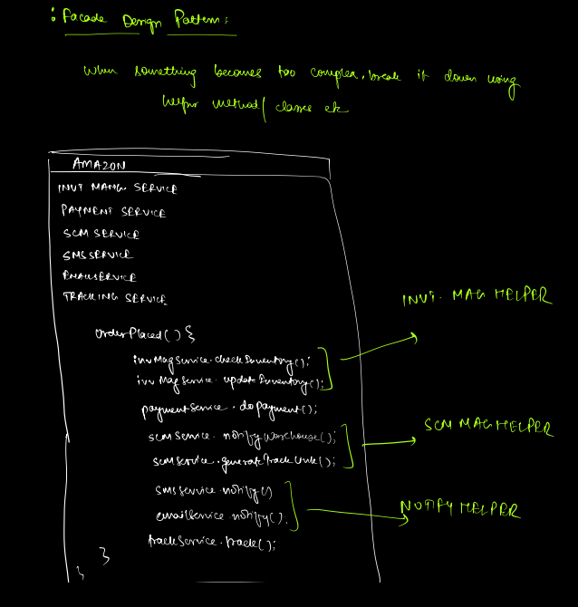
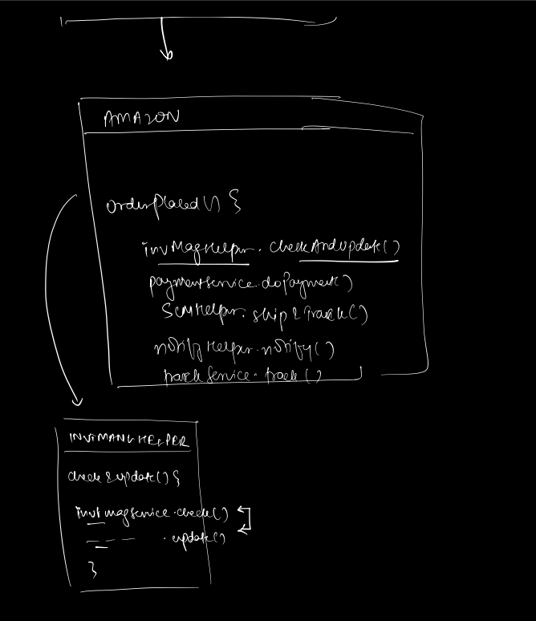
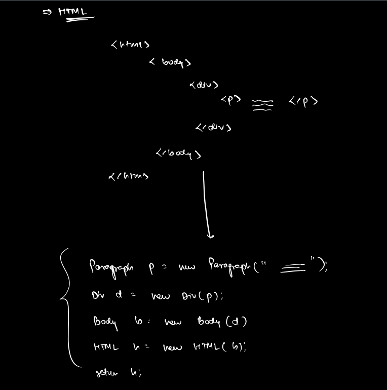
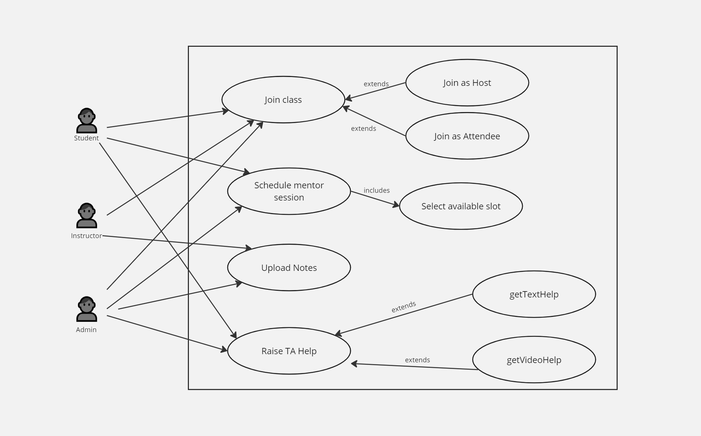

### Facade Design Pattern
https://www.baeldung.com/java-facade-pattern

#### Here, in Amazon class there are various methods for different operations after order is placed.
#### We are segregating the relevant methods to the relevant classes so that our codebase doesn't become clumsy.
#### The logic for payments, supply chain management, tracking is kept in the particular payment service, scm service, tracking service.
#### We are only calling the methods in our main Amazon class so that the main class doesn't flood with unrelated code/logic

### Decorator Design Pattern

##### HTML uses Decorator pattern

--------------------------------------------------------

### Usecase Diagram
#### Scaler System

